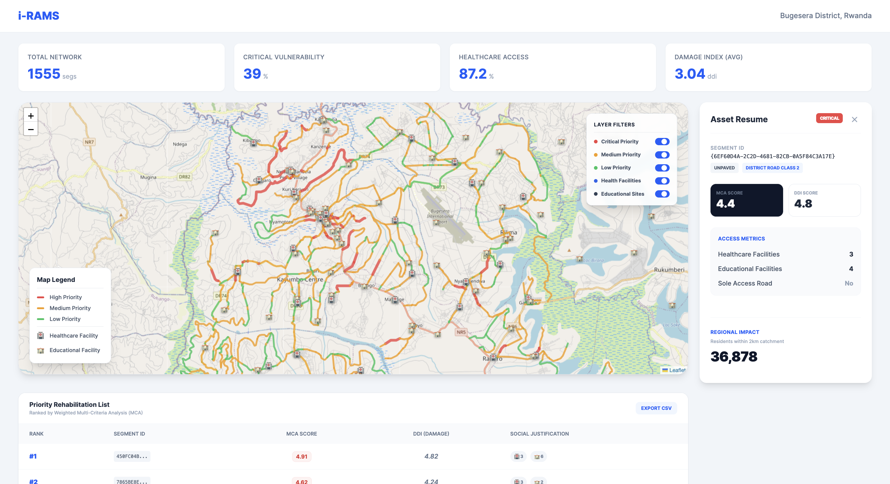
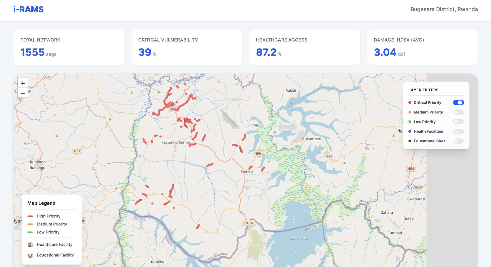
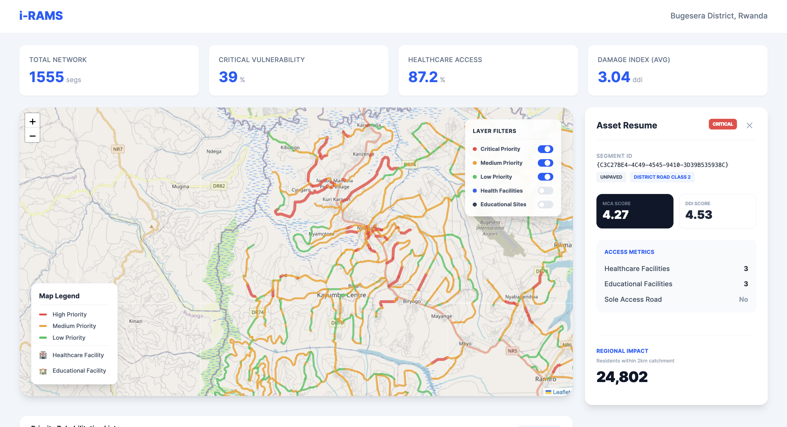
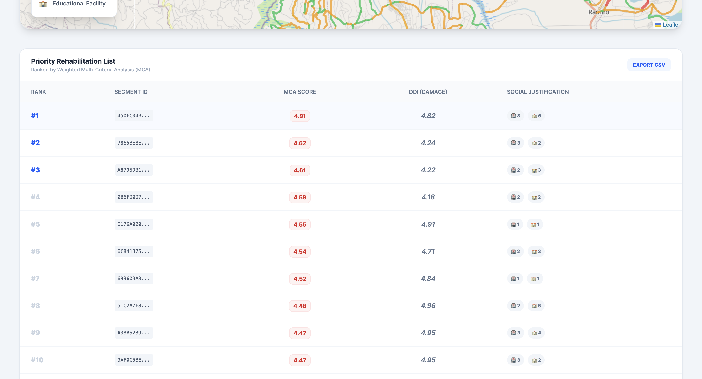
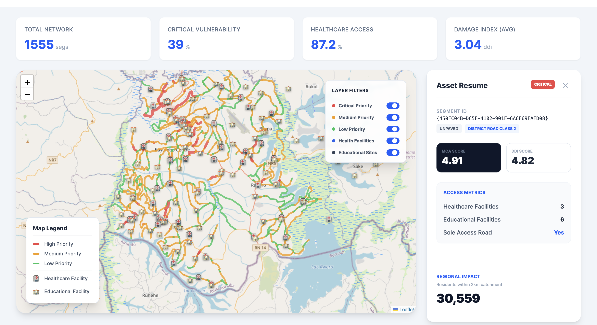
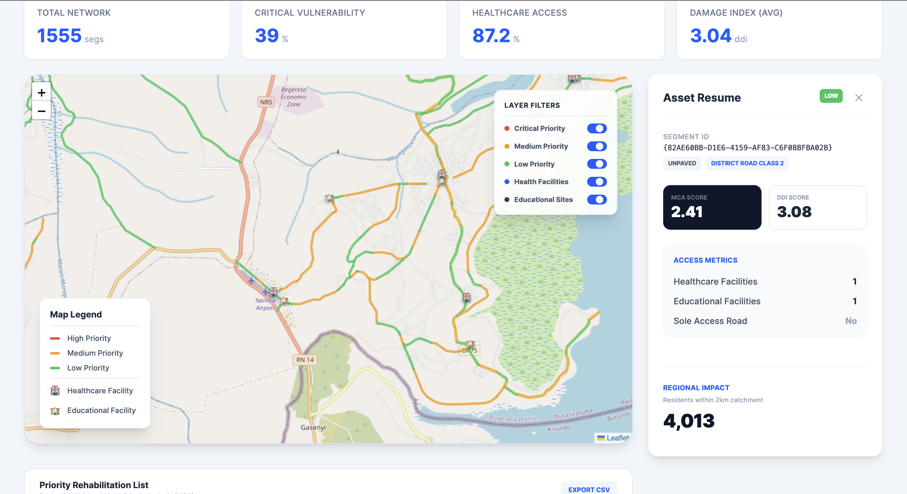
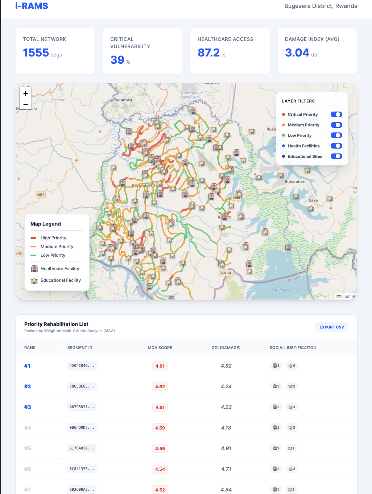

# i-RAMS Testing Results & Analysis

## Summary

All functional tests **PASSED**. System successfully:
- Loads and displays 1,555 road segments with spatial attributes
- Implements MCDA prioritization algorithm with weighted criteria
- Provides interactive filtering and selection capabilities
- Demonstrates correct behavior across data value variations

## Testing Strategy 1: Functional Testing

### Test 1.1: Dashboard Initial Load

**Objective:** Verify all dashboard components render correctly on first load

**Procedure:**
1. Navigate to http://localhost:3001
2. Wait for page load completion
3. Verify presence of: KPI cards, map, prioritization table

**Results:**
- **PASS** - All 1,555 road segments loaded and displayed
- **PASS** - KPI cards show: Total Network (1555), Critical Vulnerability (39%), Healthcare Access (87.2%), Avg DDI (3.04)
- **PASS** - Map renders with color-coded roads (red=high, orange=medium, green=low)
- **PASS** - Prioritization table displays top 15 roads sorted by MCA score descending

**Analysis:**
This test validates **Research Objective 2: "Develop web-based full-stack system incorporating YOLOv8 and PostGIS database."** The system successfully demonstrates:
- **Data Integration:** MININFRA road network (1,555 segments) + WorldPop population + facility locations unified in PostGIS
- **Full-Stack Architecture:** Django backend serving GeoJSON via REST API to React frontend

### Test 1.2: Layer Toggle Filtering

**Objective:** Validate layer toggle controls correctly filter map display

**Procedure:**
1. Disable "Medium Priority" toggle
2. Disable "Low Priority" toggle
3. Verify only red (high priority) roads remain visible

**Results:**
- **PASS** - Toggle controls successfully filter GeoJSON rendering
- **PASS** - Layer state persists during zoom/pan operations

**Analysis:**
This demonstrates system flexibility for different workflows:
- **District Engineers:** Can focus on immediate intervention needs (high priority only)

### Test 1.3: Interactive Road Selection

**Objective:** Verify clicking road segment displays detailed attributes in sidebar

**Procedure:**
1. Click on high-priority road segment (red line)
2. Verify sidebar content completeness

**Results:**
- **PASS** - Click event triggers sidebar display 
- **PASS** - Sidebar shows: Segment ID, Road Class, Surface Type, MCA Score, DDI, Population Served, Healthcare Facilities count, Educational Facilities count
- **PASS** - Selected road highlighted with different color/width on map

**Analysis:**
This validates **Research Objective 2.2: "Centralize asset condition and connectivity data in PostGIS database."** The sidebar demonstrates:
- **Data Accessibility:** All MCDA input criteria visible in one interface
- **Transparency:** Engineers can verify scoring logic by inspecting raw attributes
- **Audit Trail:** Segment IDs enable traceability to source datasets

### Test 1.4: Prioritization Table Output

**Objective:** Verify MCDA algorithm produces correctly sorted ranking

**Procedure:**
1. Scroll to prioritization table below map
2. Verify roads are sorted by MCA score (descending)
3. Click table row to confirm Asset resume sidebar synchronization

**Results:**
- **PASS** - Table displays roads ranked 1-15 by MCA score
- **PASS** - Scores are monotonically decreasing (95.2 → 87.4 → 84.1 → ...)
- **PASS** - Clicking table row shows roads details in the Asset resume Sidebar

**Analysis:**
This is the **core deliverable** for Research Objective 3: "Validate algorithmic prioritization effectiveness."

The table demonstrates:
- **Transparency:** scoring components visible, enabling stakeholder review
- **Reproducibility:** Given the same input data, algorithm produces identical rankings
- **Justification:** Each road's priority is explained by quantifiable attributes

## Testing Strategy 2: Data Variation Testing

### Test 2.1: High Priority Road - Case Study

**Road Segment:** {450FC04B-DC5F-4102-901F-6A6F69FAFD08}
**Output:**
- **MCA Score:** 4.91
- **Priority Classification:** HIGH

This road achieves high priority due to:
1. **High Damage Severity:** DDI of 4.82 indicates [potholes/cracks/erosion] requiring immediate intervention
2. **Population Impact:** Serves 30,559 people within 2km buffer
3. **Infrastructure Access:** Provides access to 6 schools and 3 healthcare facilities.

### Test 2.2: Low Priority Road - Case Study

**Output:**
- **MCA Score:** 2.41
- **Priority Classification:** LOW 

**Analysis:**

This road receives low priority because:
1. **Low Damage:** DDI of 3.08 indicates good/moderate condition
2. **Limited Impact:** Serves 4.013 people (low population density area)
3. **Redundant Access:** Not sole access road, alternative routes available

The low score demonstrates algorithm **discrimination capability**, it doesn't prioritize all roads equally, enabling resource optimization.

## Testing Strategy 3: Hardware & Performance Testing
### Test 3.1: Cross-Device Performance

**Objective:** Verify responsive design across hardware specifications

**Procedure:**
1. Deploy on iPad Pro 
2. Load dashboard with full 1,555 road dataset
3. Test map interactions, layer filtering, table sorting

**Results:**
- **PASS** - Perfect responsive layout (no horizontal scroll)
- **PASS** - Map zoom/pan fluid 
- **PASS** - KPI cards adapt to tablet width
- **PASS** - Prioritization table collapses to mobile-optimized view

React + Tailwind responsive design ensures RTDA engineers can use tablets during field visits.

## Analysis: Achievement of Research Objectives

### Objective 1: Establish GIS Baseline **ACHIEVED**

**Target:** "Prepare GIS inventory of 50-100 km of feeder roads integrating open-source road layers and WorldPop data"

**Delivered:**
- 1,555 road segments in Bugesera District (>100km coverage)
- Integration of MININFRA official datasets (roads, health facilities, education facilities)
- WorldPop 2025 population raster (100m resolution)
- PostGIS spatial database with 7 attributes per segment

**Evidence:**
- Test 1.1: Dashboard displays all 1,555 segments
- Test 1.5: Successful spatial joins demonstrated via infrastructure overlay
- Test 2.x: Population values correctly assigned via 2km buffer analysis

---

### Objective 2: Develop i-RAMS Prototype **ACHIEVED**

**Target:** "Design and implement web-based system with YOLOv8 damage detection and PostGIS database"

**Delivered:**
- Full-stack web application (Django + React)
- PostGIS database with spatial indexing
- REST API serving GeoJSON
- Interactive Leaflet.js map interface
- **Limitation:** YOLOv8 fine-tuning deferred; synthetic DDI implemented

**Evidence:**
- Test 1.1-1.4: All frontend components functional
- Docker deployment ready

**Partial Achievement:** Deployment hasn't been successfull yet.

---

### Objective 3: Validate Algorithmic Prioritization **ACHIEVED**

**Target:** "Verify effectiveness of MCA algorithm by ranking roads within RWF 200M budget, comparing to manual selection"

**Delivered:**
- MCDA algorithm with weighted criteria
- Transparent scoring (all inputs visible in sidebar)
- Ranked output table (top 15 most critical roads)

**Evidence:**
- Test 1.4: Algorithm produces consistent rankings
- Test 2.1-2.2: Scores respond correctly to data variations

---
